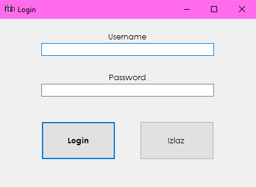
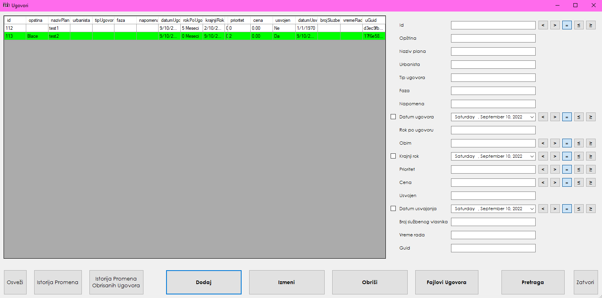
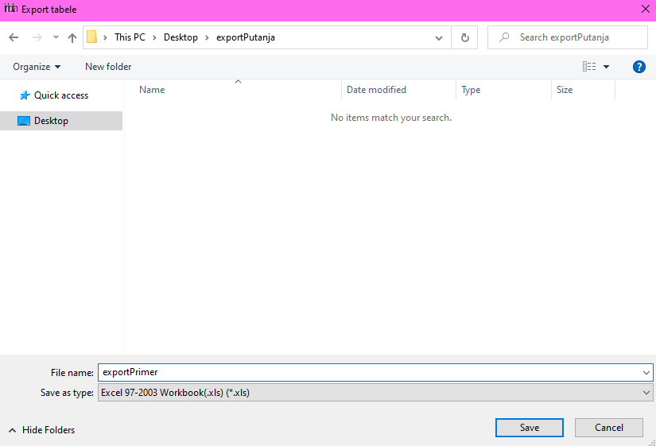
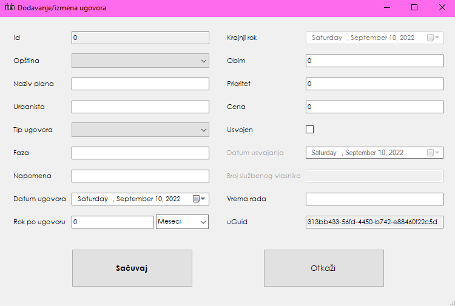

**Uputstvo za korišćenje softvera za ugovore Infoplana**

Nakon otvaranja programa, korisnik mora uneti svoj username i password koji su podesili kod administratora.

Nakon uspešnog prijavljivanja otvara se glavni meni:

„Detalji" otvara prozor o detaljima softvera a „Logout" odjavljuje korisnika i vraća se na „Login" formu.

Klikom na dugmad „Opštine" i „Tipovi Ugovora" mogu se videti opštine i tipovi ugovora. Funkcionalnost dodavanja imaju samo administratori:

 

Sa glavnog menija korisnici mogu da ismene svoj username i password, dok mogućnost menjanja privilegije imaju samo administratori:

Sa glavnog menija administrator mogu da vide sve korisnike i njihove privilegije ali ne I njihove password-e, klikom na dugme izmeni takođe ostavlja prazno polje na mesto passworda, ovo je namenjeno u slučaju da korisnik zaboravi svoj password ili ne može da se uloguje, tada administrator može da stavi novi. Administratori takođe ovde mogu da prave nove korisnike:

Klikom na „Dodaj" otvara se forma gde administrator može da doda novog korisnika i njihovu privilegiju:

Korisnik može da radi sve osnovne funkcionalnosti, ali ne može da briše podatke iz tabela i da dodaje nove korisnike za razliku od administratora koji može sve da radi. Turista može samo da gleda tabele i vrši pretragu nad ugovorima.

Sa glavnog menija klikom na dugme „Ugovori" otvara se forma sa prikazom svih ugovora:

 
Ugovori su obojeni u skladu sa poljem „status". Podaci u tabelama na svakoj formi mogu da se sortiraju klikom na ime željene kolone. Korisnici mogu da vrše pretragu ugovora po svim poljima. Brojni i datumski podaci mogu se pretraživati sa „manje, veće i jednako". Klikom na kvadratiće ispred polja za datume se oni uključuju/isključuju sa pretrage. Pretraga se vrši na dugme „Pretraga". Dugme „Osveži" ponovo učitava celu tabelu. „Istorija Promena" prikazuje istoriju promena svakog polja za izabrani ugovor koji se bira klikom na red u tabeli. „Istorija Promena Obrisanih Ugovora" radi isto, samo za obrisane ugovore koji se na tabeli ne vide. „Dodaj" otvara novu formu gde korisnici mogu da dodaju novi ugovor sa različitim parametrima:

Polja „Opština", „Tip Ugovora", „Rok po ugovoru (tekst)" i „Status" su padajući meniji, gde mogu da se izaberu odgovarajuće vrednosti. Polje „Krajnji rok" se automatski menja u odnosu na datum ugovora kad korisnik menja vrednost i interval roka po ugovoru. Kod svih formi menjanja ili dodavanja, „Sačuvaj" vrši zadate promene a „Otkaži" ih odbacuje i ne menja tabele.

Sa forme „Ugovori", „Izmeni", otvara istu formu kao i za dodavanje, samo za odabrani ugovor sa forme. Ovde korisnici mogu da menjaju podatke o ugovoru. Otvaranje forme za izmenu takođe može da se izvrši duplim klikom na željeni ugovor. Ako korisnik otvori formu za dodavanje ili izmenu a u među vremenu neki drugi korisnik izvrši promenu nad istim ugovorom, pojavljuje se prozor greške. Ovim se omogućava ispravan rad nad bazom podataka.

Dugme „Obriši", na formi „Ugovori", briše odabrani ugovor i ovo mogu samo administratori da rade.

„Fajlovi ugovora" otvara formu gde su prikazani svi vezani fajlovi i njihove putanje za izabrani ugovor:

Klikom na „Prikaži" ili duplim klikom na željeni ugovor, otvara se izabrani ugovor u odgovarajućem programu u skladu sa tipom fajla. Klikom na „Dodaj" otvara se prozor gde može da se izabere jedan željeni fajl za dodavanje:

Na formi „Fajlovi ugovora" „Ukloni" briše fajl iz tabele ali ne fajl na disku. Ovo takođe samo administratori mogu da urade.
